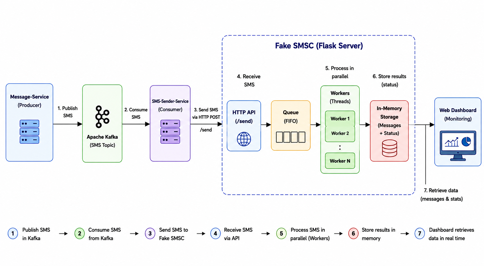

# 📡 Fake SMSC Simulator

> A lightweight SMSC Gateway simulator built for testing SMS delivery pipelines in distributed, Kafka-based architectures.

---

## Overview

In real telecom environments, an **SMSC (Short Message Service Centre)** is the infrastructure responsible for routing, storing, and delivering SMS messages. Testing against a live SMSC is expensive and often impossible in development environments.

This project simulates that gateway — receiving SMS requests and returning realistic delivery statuses — so upstream services can be tested end-to-end without touching real telecom infrastructure.

Built as part of a **Bulk SMS Marketing Platform** developed in collaboration with **Ooredoo Algeria**, using a Kafka microservices architecture.

---

## Architecture



**Flow (7 steps):**

1. Message-Service publishes SMS events to Kafka
2. SMS-Sender-Service consumes from the Kafka topic
3. SMS-Sender-Service sends each SMS via HTTP POST to `/send`
4. Fake SMSC receives the request through its HTTP API
5. Messages are queued (FIFO) and processed in parallel by worker threads
6. Each worker simulates delivery and stores the result in memory
7. The web dashboard retrieves messages and stats in real time

---

## Features

- **REST API endpoint** — receives SMS via `POST /send`
- **Parallel processing** — configurable worker threads for concurrent delivery simulation
- **Realistic status simulation** — returns `SENT`, `DELIVERED`, or `FAILED` with weighted randomness
- **In-memory storage** — stores all messages and their statuses for the session
- **Live web dashboard** — monitor delivery stats and message logs in real time
- **Zero external dependencies** — no database, no broker required to run standalone

---

## Tech Stack

| Layer | Technology |
|---|---|
| Server | Python / Flask |
| Concurrency | Python `threading` + `queue.Queue` |
| API | REST / JSON |
| Frontend | HTML / CSS / Vanilla JS |
| Storage | In-memory (Python dict) |

---

## Project Structure

```
fake-smsc-simulator/
│
├── services/
│   ├── sms_processor.py      # Delivery simulation logic
│   └── storage.py            # In-memory message store
├── static/
│   ├── app.js
│   └── style.css
├── templates/
│   └── index.html
├── utils/
│   └── simulator.py
├── app.py
├── requirements.txt
└── README.md
```

---

## Getting Started

```bash
git clone https://github.com/<your-username>/fake-smsc-simulator.git
cd fake-smsc-simulator
pip install -r requirements.txt
python app.py
```

Server starts on `http://localhost:5000`.

---

## API Reference

### `POST /send`

```json
// Request
{ "msisdn": "213XXXXXXXXX", "message": "Your OTP is 4821" }

// Response
{ "status": "QUEUED", "id": "uuid-xxxx" }
```

Delivery status (`SENT`, `DELIVERED`, `FAILED`) is updated asynchronously by worker threads.

### `GET /messages`

Returns all received messages and their current delivery statuses.

---

## Context

This simulator was developed as a component of a **Bulk SMS Marketing Platform** featuring:

- Kafka-based microservices (Spring Boot)
- AI-powered SMS generation (fine-tuned Mistral-7B with LoRA)
- K-Means subscriber segmentation
- React/TypeScript frontend

---

